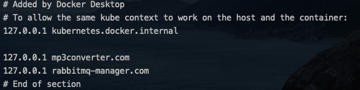
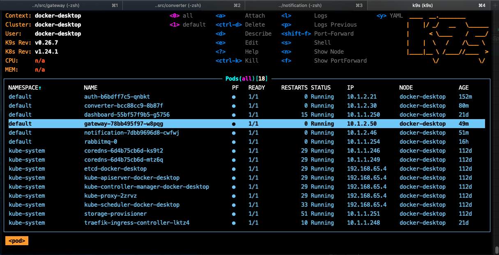

## Microservice Architecture and System Design with Python & Kubernetes

<br>
This is a simple simple microservice built to demonstrate the [Microservice Architecture Pattern](http://martinfowler.com/microservices/) using Python, Flask, Docker and Kubenetes. The project is intended as a tutorial, but you are welcome to fork it and turn it into something else!

<br>

### Getting Started
You'll need to do the following pre-requisites before you can use Docker Stacks to perform Kubernetes deployments using YAML files.

### Pre-requisites:

- Install kubectl (https://kubernetes.io/docs/tasks/tools/install-kubectl/)
- Enable Kubernetes (From Docker Desktop)
Turn on Experimental Features (From Docker Desktop)
You can quickly tackle the last two pre-requisites by configuring the Docker preferences pane—which can be found from the menu in the Docker Desktop system tray.
- Make sure Kubernetes enable Ingress.

### How to run

Before run in Kubernetes, You should be change something to make sure while running is correct.
- email, email password to use stmp.
- connection mysql
- connection mongodb

```bash
kubectl apply -f auth/manifests
kubectl apply -f rabbitmq/manifests
kubectl apply -f converter/manifests
kubectl apply -f notification/manifests
kubbectl apply -f gateway/manifests
```

Please configuration into `/etc/hosts` file like this



- Get token by email and password.

```bash
curl -X POST http://mp3converter.com/login -u email:password
```

- Get token using for APIs later.

- Install `youtube-dl` to download video in youtube if you like.

```bash
youtube-dl https://youtu.be/eZJhYgPE3Eg test.mkv
```

- Upload video API

```bash
curl -X POST -F 'file=@./test.mkv' -H 'Authorization: Bearer your_token_here' http://mp3converter.com/upload
```

- Please install [k9s](https://k9scli.io/) to monitoring kubernetes.

```bash
k9s
```


- Check you email and try api get mp3 file.

```bash
curl --output something.mp3 -X GET 'http://mp3converter.com/download?fid=6370a832268bc743b21c729f' \
--header 'Authorization: Bearer your_token_here'

```

#### Happy coding :))


### Reference

[Youtube](https://www.youtube.com/watch?v=hmkF77F9TLw)
